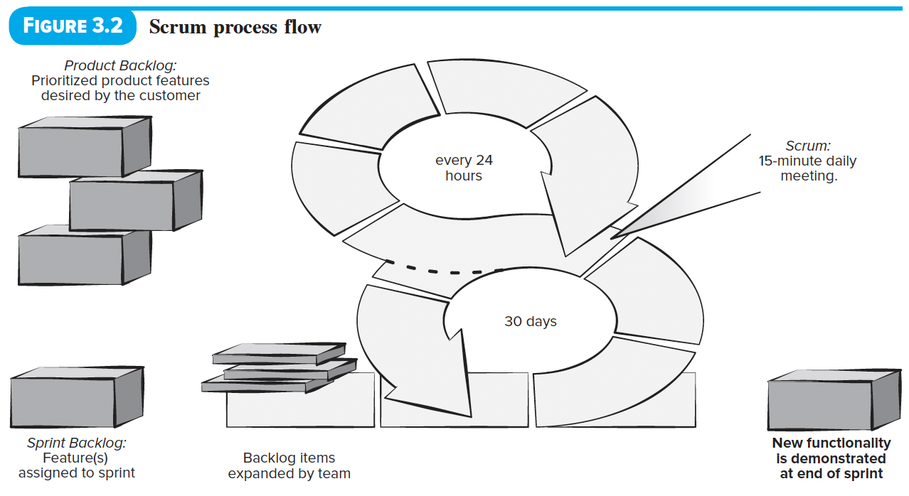

# Agile
 - Facile (effortless) communication between team members amidst changes
 - Customers are involved in the software development process

## Agile and the Cost of Change
 
 
 - Accommodate changes late in software project without dramatic impact in cost and time impact
  - How? Incremenetal delivery, continuous unit testing, and pair programming

> [!NOTE]
> Pair programming is not necessary to establish the reduced cost. But the principle behind, collaborative work, is.

## Agile Process
1. Handle unpredictability by becoming adaptable
2. An incremetable development strategy allows (1)
3. An iterative approach accomplishes the following:
 - Customers evalaute the incremental software regularly
 - Developers and the team can effectively address the feedback

## Agility Principles
1. Our highest priority is to satisfy the customer through early
and continuous delivery of valuable software.
2. Welcome changing requirements, even late in development.
Agile processes harness change for the customer's competitive
advantage.
3. Deliver working software frequently, from a couple of weeks to
a couple of months, with a preference to the shorter timescale.
4. Business people and developers must work together daily
throughout the project.
5. Build projects around motivated individuals. Give them the
environment and support they need, and trust them to get the
job done.
6. The most efficient and effective method of conveying
information to and within a development team is face–to–face
conversation. 
7. Working software is the primary measure of progress.
8. Agile processes promote sustainable development. The
sponsors, developers, and users should be able to
maintain a constant pace indefinitely.
9. Continuous attention to technical excellence and good
design enhances agility.
10. Simplicity – the art of maximizing the amount of work
not done – is essential.
11. The best architectures, requirements, and designs
emerge from self–organizing teams.
12. At regular intervals, the team reflects on how to become
more effective, then tunes and adjusts its behavior
accordingly.

# Agile Methodologies

## Scrum
 
 
Composition:
1. Product Owner
2. Scrum Master
3. Small Development Team (3-6 people)

| Concept | Description |
| -- | -- |
| Sprint | Incremental prototype development that lasts 2-4 weeks |
| Product Backlog | List of requirements/features that provides business value for the customer This is decided by the Product Owner |
| Sprint Backlog | Product Team selects product backlog items which will be completed as the code increment during the current active sprint No new features can be added unless the sprint is cancelled and restrated. | 
| Scrum Master| 1. Guides the Product Owner in defining clear and concise backlogs 2. Runs the daily Scrum Meeting 3. Helps the team members removes obstacles in developmen t | 

1. Sprint Planning Meeting
  - Product Owner decides the increment goal in the upcoming week
  - The Scrum Master and Development team add items to the Sprint Backlog which are achievable in the given time
  - The Development team decides on their roles based on the items
2. Daily Scrum Meeting
 - 15-minute schedule meeting that allows the team to sync their activities in the next 24-hours
 - 3 Core Questions
   - What did you do since the last meeting?
   - What obstacles are you encountering?
   - What do you plan to accomplish by the next team meeting?

> [!NOTE]
> The Scrum Master aids the developers completing tasks on time and setting realistic goals.

3. Sprint Review Meeting
 - Demo of software increment
 - Product Owner may accept the increment
 - Product Owner and stakeholders provide feedback
4. Sprint Retrospective
 - 3-hour meeting
 - Discuss:
   - What went well
   - What could be improved
   - What the team will commit to improving in the next sprint

## Kanban Methodology
 

- Focuses on change management and service delivery.
- Team memembers are given the freedom to manage their tasks.

> [!NOTE]
> Originated from Toyota's Industrial Engineering practices and was adapted in Software Development by David Anderson.

### Principles
1. Visualize workflow using a Kanban Board.
2. Limiting the amount of work in progress (WIP) in any given time.
3. Manage workflow to reduce waste (Understand current value flow > Analyze where it is stalled > Define changes > Implement changes)
4. Making policies process explicit (e.g. provide reasons for selecting items to work on and provide criteria for "done")
5. Focus on continuous improvement (Create feedback loops)
6. Make prpocess changes collaboratively and involve all team members and other stakeholders as needed.

### Meetings
1. Daily (Walking the board)
  - Identify any missing items
  - Add them to the board
  - Advance any items they can to "done"
  - GOAL: Advance high business value items first
2. Weekly
 - Examine process measurements

> [!NOTE]
> You can mix Kanban with other agile development practices

## DevOps
 

The Development and Operations approach loop continuously until the desired product exists.

| # | Stage | Brief Description |
| -- | -- | -- |
| 1 | Continuous Development | Break down software deliverables into multiple sprints (increments) |
| 2 | Continious Testing | Utilize automated testing tools in multiple code interements--preparing the code for integration |
| 3 | Continuous Integration | Increments are added to the existing code and the run-time enviroment. Ensuring there are no errors after deployment |
| 4 | Continuous Deployment | Integrated code is deployed to the production enviroment |
| 5 | Continuous monitoring | Improve software quality by monitoring is performance in prod and proactively looking for possible problems before users find them. |

 

 > [!NOTE]
 > Aspiring DevOps engineers should familiarize themselves with this process.
